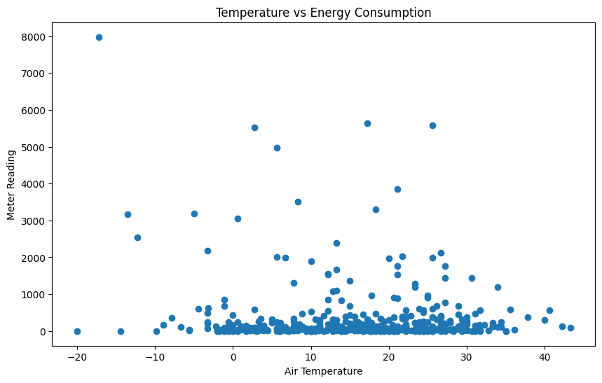
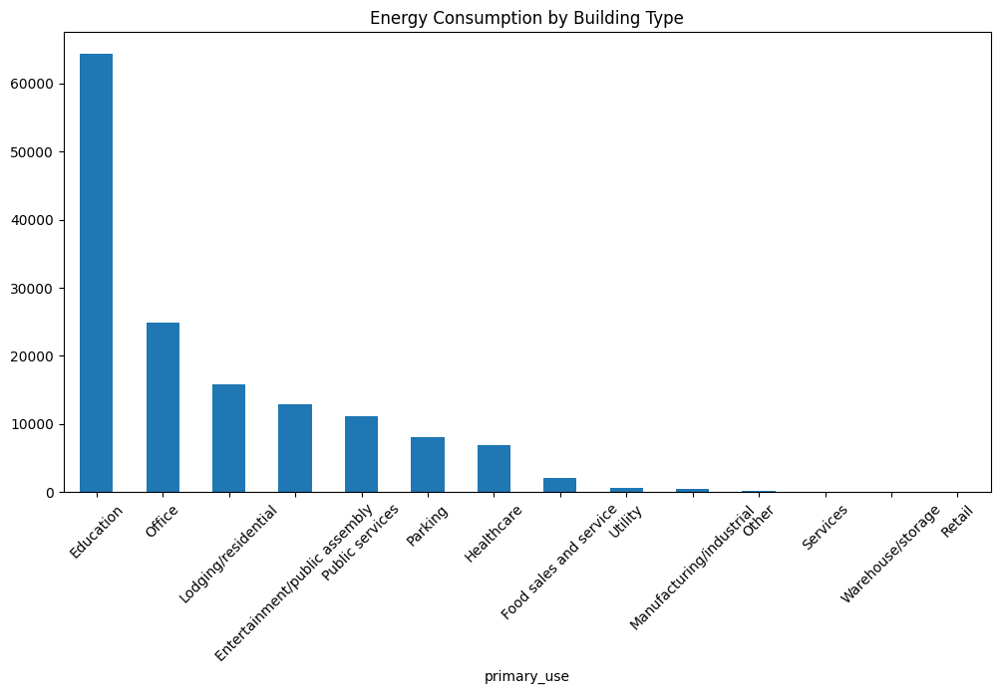
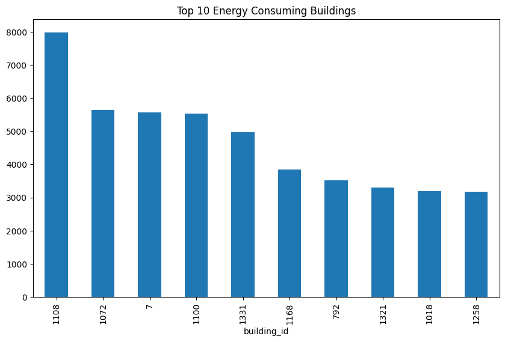
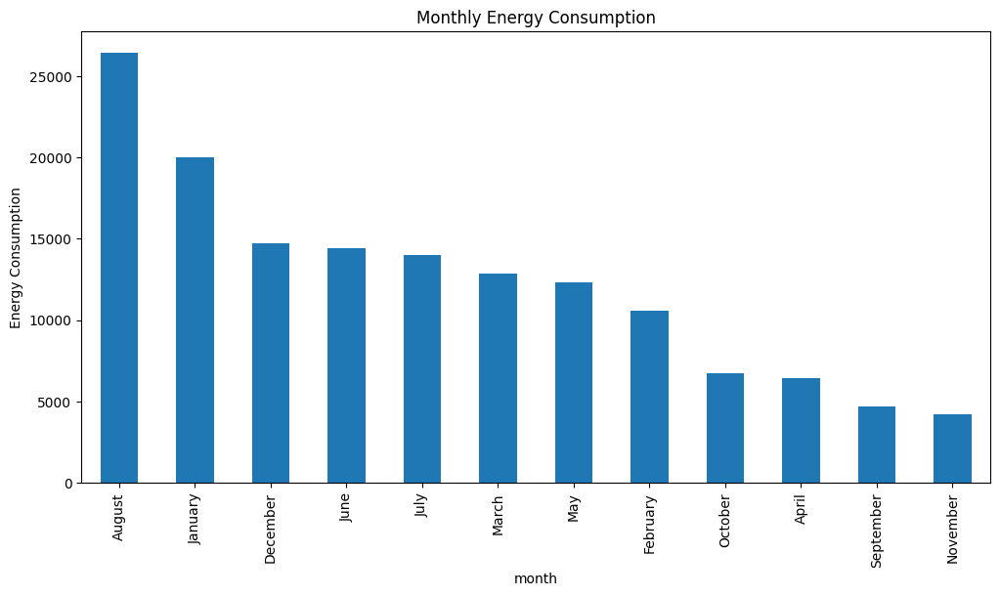

# Energy Analytics & Sustainability Reporting Platform

## GitHub Repository

Source code and project documentation:

- [Energy Analytics & Sustainability Reporting Platform](https://github.com/Kofiastro/Energy-Analytics-Sustainability-Reporting-Platform)

## Overview

This project analyzes building energy consumption data from the ASHRAE Energy Prediction dataset to identify consumption patterns, energy efficiency opportunities, and sustainability metrics.

## Objectives

- Clean and validate energy consumption data
- Analyze building performance
- Develop energy KPIs
- Calculate carbon emissions
- Build Power BI dashboards
- Automate sustainability reporting

## Technologies

- Python
- Pandas
- SQL
- PostgreSQL
- Power BI
- Git
- GitHub

## KPI Definitions

The project currently focuses on a small set of core reporting metrics. If the analysis expands, keep these definitions explicit and versioned in the documentation.

- Total Energy Consumption: the sum of all `meter_reading` values across the dataset or a selected reporting period.
- Carbon Emissions: the estimated CO2 output derived from energy consumption using the project’s reporting method or emission factor.
- Energy Intensity: energy use normalized by building size, typically measured per square foot.
- Duplicate Records: the number of repeated rows identified during the audit step.
- Missing Value Rate: the percentage of null values in each field or reporting slice.

For future KPIs, document the formula, units, source fields, and refresh cadence.

## Reporting and Delivery Notes

- Include chart exports or screenshots in `reports/figures/` when the analysis expands so the reporting package includes visual evidence.
- Extend the SQL scripts if the workflow moves into a database-backed pipeline.
- Add and maintain a changelog as the project evolves into a multi-phase reporting package.

## Executive Report

The written executive summary is available in [docs/Executive_Report.md](docs/Executive_Report.md). It highlights the main findings from the analysis, including total energy consumption, carbon emissions, seasonal trends, temperature impact, and the highest intensity building.

## Figure Gallery

The exported charts below live in `reports/figures/` and are embedded here for quick reference.

### 1. Temperature vs Energy Consumption

### 2. Energy Consumption by Building Type

### 3. Top 10 Energy Consuming Buildings

### 4. Monthly Energy Consumption

## Changelog

Project history and release notes are tracked in [CHANGELOG.md](CHANGELOG.md).