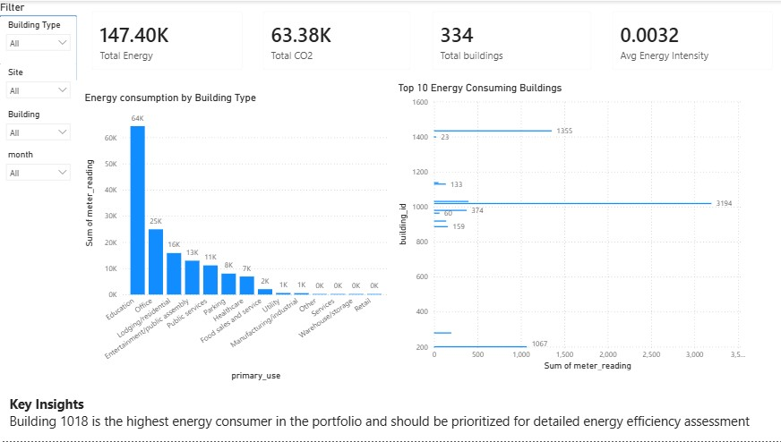
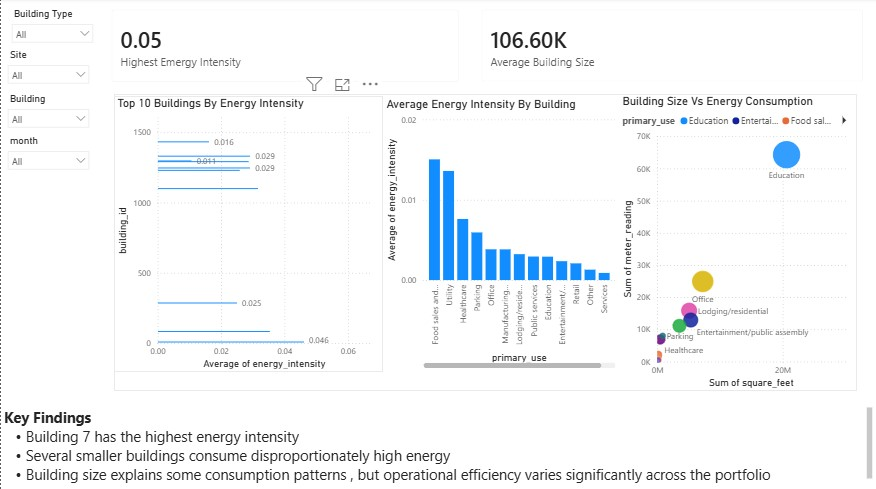
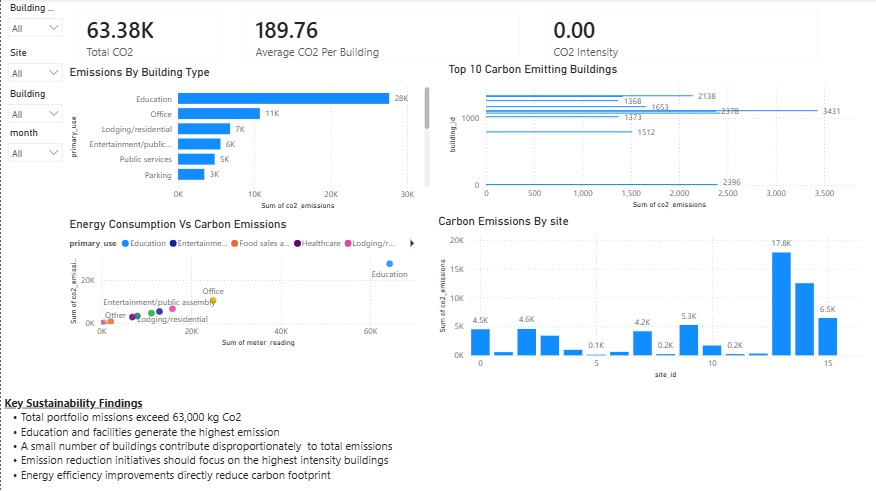
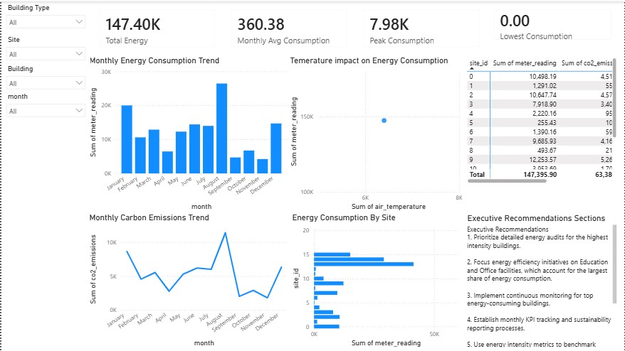

# Energy Analytics & Sustainability Reporting Platform

This repository contains a small energy analytics and sustainability reporting workflow built around the ASHRAE energy dataset. The project ingests the source CSV, audits data quality, prepares cleaned outputs, and produces analysis artifacts that can be reused for reporting, dashboards, and sustainability tracking.

## GitHub Repository

Source code and documentation for this project are available on GitHub:

- [Energy Analytics & Sustainability Reporting Platform](https://github.com/Kofiastro/Energy-Analytics-Sustainability-Reporting-Platform)

## Project Overview

The main goal is to understand building energy consumption patterns and turn them into practical sustainability metrics. The workflow focuses on:

- Cleaning and validating energy consumption data
- Analyzing building performance and usage patterns
- Developing energy KPIs
- Estimating carbon emissions
- Preparing reporting outputs for business and sustainability use cases
- Supporting downstream dashboarding in tools such as Power BI

The primary dataset is `AHSRAE.csv`, and the project organizes its work across notebooks, SQL, source utilities, and generated report artifacts.

## What Is Included

This consolidated README bundles the content that was previously split across the documentation pages in `docs/`:

- Overview of the project and objectives
- Notebook descriptions and processing steps
- Data directory and artifact layout
- Source code notes
- Reports and output inventory
- Local documentation server instructions

## Dashboards

## Executive Summary Dashboard




## Building Performance Dashboard




## Sustainability Dashboard




## Energy Trends Dashboard



Description of the Dashboard 
## **Dashboard Pages**

### **1. Executive Summary Dashboard**

Provides a high-level overview of portfolio energy performance.

#### **Key Metrics**

- Total Energy Consumption: 147,395.90
- Total Carbon Emissions: 63,380.24 kg CO₂
- Total Buildings Analyzed
- Average Energy Intensity

#### **Key Insights**

- Education facilities were the largest energy consumers.
- A small number of buildings contributed disproportionately to overall consumption.
- Energy consumption patterns varied significantly across building categories.

---

### **2. Building Performance Dashboard**

Evaluates building efficiency and operational performance.

#### **Visualizations**

- Top 10 Buildings by Energy Intensity
- Building Size vs Energy Consumption
- Average Energy Intensity by Building Type

#### **Key Findings**

- Building 7 exhibited the highest energy intensity.
- Several smaller buildings demonstrated disproportionately high energy usage.
- Building size was moderately correlated with energy consumption (0.488).

This dashboard helps identify buildings that should be prioritized for energy audits and efficiency improvement initiatives.

---

### **3. Sustainability & Carbon Emissions Dashboard**

Focuses on greenhouse gas emissions reporting and sustainability performance.

#### **Visualizations**

- Carbon Emissions by Building Type
- Top 10 Carbon Emitting Buildings
- Energy Consumption vs Carbon Emissions
- Carbon Emissions by Site

#### **Key Findings**

- Total emissions exceeded 63,000 kg CO₂.
- Education and Office facilities generated the largest share of emissions.
- High-energy-consuming buildings were also the largest carbon emitters.
- Emissions reduction efforts should prioritize high-intensity facilities.

---

### **4. Energy Trends & Performance Monitoring Dashboard**

Supports energy baseline development and performance tracking.

#### **Visualizations**

- Monthly Energy Consumption Trend
- Monthly Carbon Emissions Trend
- Temperature Impact on Energy Consumption
- Energy Consumption by Site
- Site Performance Matrix

#### **Key Findings**

- August recorded the highest energy consumption.
- Temperature showed a weak negative correlation with energy use (-0.111).
- Seasonal energy consumption patterns were identified.
- Monthly monitoring supports continuous improvement and performance verification.
## Repository Structure

```text
Energy Analytics & Sustainability Reporting Platform/
├── AHSRAE.csv
├── README.md
├── data/
│   ├── raw/
│   └── processed/
├── docs/
│   ├── README.md
│   ├── _coverpage.md
│   ├── _footer.md
│   ├── _navbar.md
│   ├── _sidebar.md
│   ├── _theme.css
│   ├── data.md
│   ├── index.html
│   ├── notebooks.md
│   ├── reports.md
│   └── src.md
├── notebooks/
│   ├── 01_data_audit.ipynb
│   ├── 02_data_cleaning.ipynb
│   └── 03_exploratory_analysis.ipynb
├── reports/
│   ├── audited_data.csv
│   ├── cleaned_data.csv
│   ├── final_energy_analysis.csv
│   └── missing_values_report.csv
├── sql/
│   ├── business_queries.sql
│   └── create_tables.sql
└── src/
	└── load_energy_data.py
```

## Objectives

- Clean and validate energy consumption data
- Analyze building performance
- Develop energy KPIs
- Calculate carbon emissions
- Build Power BI dashboards
- Automate sustainability reporting

## Technology Stack

- Python
- Pandas
- NumPy
- Matplotlib
- SQL
- PostgreSQL
- Power BI
- Git and GitHub

## KPI Definitions

The project currently focuses on a compact set of reporting KPIs. If the analysis expands, keep the metrics explicit so results stay consistent and comparable.

- Total Energy Consumption: the sum of all `meter_reading` values across the full dataset or a selected reporting window.
- Carbon Emissions: the estimated CO2 output calculated from energy use using the project's emission rule or emission factor.
- Energy Intensity: normalized energy consumption, usually expressed per square foot.
- Duplicate Records: the number of repeated rows flagged during auditing.
- Missing Value Rate: the percentage of null values in each column or data segment.

For any new KPI, document the formula, units, source fields, and refresh cadence.

## Notebook Workflow

### 1. `01_data_audit.ipynb`

This notebook establishes the baseline dataset audit. Based on the current notebook content, it performs the following work:

- Imports `pandas` and `numpy`
- Loads `../AHSRAE.csv`
- Displays the first few rows with `head()`
- Checks dataset shape using `df.shape`
- Inspects data types with `df.info()`
- Counts missing values with `df.isnull().sum()`
- Calculates missing-value percentages
- Converts the `timestamp` column to datetime
- Checks for duplicate records
- Generates descriptive statistics with `df.describe()`
- Computes a first KPI using total `meter_reading`
- Plots an energy consumption trend over time
- Exports the audited dataset to `../reports/audited_data.csv`

This notebook is the audit and validation entry point for the entire project.

### 2. `02_data_cleaning.ipynb`

This notebook handles the transformation of the raw audited data into a cleaner analysis-ready form. Its role is to:

- Address missing values
- Standardize fields and types
- Clean or remove problematic records
- Produce the cleaned dataset used in later analysis
- Export `reports/cleaned_data.csv`

The documentation in the project indicates that missing weather variables and building metadata were handled through median imputation.

### 3. `03_exploratory_analysis.ipynb`

This notebook explores the cleaned dataset and turns the outputs into analysis and reporting insights. It typically covers:

- Energy consumption patterns
- Building-level comparison
- KPI derivation
- Carbon footprint interpretation
- Visual summaries for reporting

## Data Documentation

### Input Data

- `AHSRAE.csv` is the source file used to build the analysis pipeline.

### Working Data Directories

- `data/raw/` stores original or untouched inputs.
- `data/processed/` stores datasets that have already been transformed for analysis.

### Report Artifacts

- `reports/audited_data.csv` is the output of the audit notebook.
- `reports/cleaned_data.csv` is the cleaned dataset after preprocessing.
- `reports/final_energy_analysis.csv` contains final analysis outputs.
- `reports/missing_values_report.csv` summarizes missing-data diagnostics.
- `docs/Executive_Report.md` contains the written executive summary of the analysis.

### Reports Folder Layout

- `reports/README.md` explains how to use the reporting folder.
- `reports/figures/` is the home for exported charts, screenshots, and visual evidence.

### Current Figure Gallery

The reports folder currently includes these exported charts:

- `reports/figures/1.png` - Temperature vs Energy Consumption
- `reports/figures/2.png` - Energy Consumption by Building Type
- `reports/figures/3.png` - Top 10 Energy Consuming Buildings
- `reports/figures/4.png` - Monthly Energy Consumption

### Executive Report

The written summary for stakeholders is available in [Executive_Report.md](Executive_Report.md). It captures the main findings, including total energy consumption, carbon emissions, building type analysis, seasonal trends, temperature impact, and the highest intensity building.

## Data Quality Notes

The project notes highlight two major quality concerns:

- Weather variables contained missing values
- Building metadata also contained missing values

The cleaning workflow addressed these issues through median imputation, which allowed the analysis to continue without dropping large portions of the dataset.

## Source Code

The `src/` directory contains helper code for loading and preparing the dataset.

- `src/load_energy_data.py` provides data-loading and preparation utilities

Example usage from the project root:

```bash
python "Energy Analytics & Sustainability Reporting Platform/src/load_energy_data.py" --help
```

## Reports and Outputs

The `reports/` directory contains the main deliverables generated from the notebooks and analysis pipeline.

### Key Outputs

- `audited_data.csv` captures the dataset after the initial audit
- `cleaned_data.csv` captures the cleaned and analysis-ready dataset
- `final_energy_analysis.csv` captures final metrics and outputs used in reporting
- `missing_values_report.csv` captures missingness diagnostics for the source data

### Report Themes

The generated outputs support the following business-facing insights:

- Highest energy consuming buildings
- Estimated carbon footprint
- Dataset overview and record counts
- Sustainability reporting baselines
- ESG and decarbonization planning
- Emission reduction tracking

## Insight Areas

The existing documentation and generated outputs indicate the project is designed to surface:

- Top energy-consuming buildings by consumption
- Dataset overview metrics such as total records, buildings analyzed, and total energy consumption
- Carbon footprint estimates in kilograms of CO₂
- Business recommendations for sustainability reporting and energy reduction planning

## Documentation Site

The project also includes a Docsify-based documentation site in `docs/`.

### Local Preview

```bash
# from the project root
npx docsify-cli serve "Energy Analytics & Sustainability Reporting Platform/docs" -p 3000

# or, if you are already inside the docs folder
cd "Energy Analytics & Sustainability Reporting Platform/docs"
npx docsify-cli serve . --port 3000
```

Then open http://localhost:3000 in your browser.

### Docsify Theme Files

- `docs/index.html` loads the Docsify runtime and theme assets
- `docs/_theme.css` provides custom styling overrides
- `docs/_navbar.md` defines top navigation
- `docs/_sidebar.md` defines the left navigation
- `docs/_coverpage.md` defines the landing cover
- `docs/_footer.md` defines the footer

## Reproducing the Workflow

1. Open `notebooks/01_data_audit.ipynb` and run the audit steps.
2. Review `reports/audited_data.csv` and the missing-value diagnostics.
3. Open `notebooks/02_data_cleaning.ipynb` and generate the cleaned dataset.
4. Run `notebooks/03_exploratory_analysis.ipynb` to create final insights and visuals.
5. Review the CSV outputs in `reports/` for reporting and dashboarding.

## Practical Use Cases

This project can support:

- Energy performance monitoring
- Sustainability reporting
- ESG reporting
- Decarbonization planning
- Emissions tracking
- Building benchmark analysis

## Changelog

Project history and release notes are tracked in [../CHANGELOG.md](../CHANGELOG.md).

## Quick Start

If you only need the documentation site, run:

```bash
cd "Energy Analytics & Sustainability Reporting Platform/docs"
npx docsify-cli serve . --port 3000
```

If you want the project outputs, open the notebooks in order and use the generated CSV files in `reports/`.
